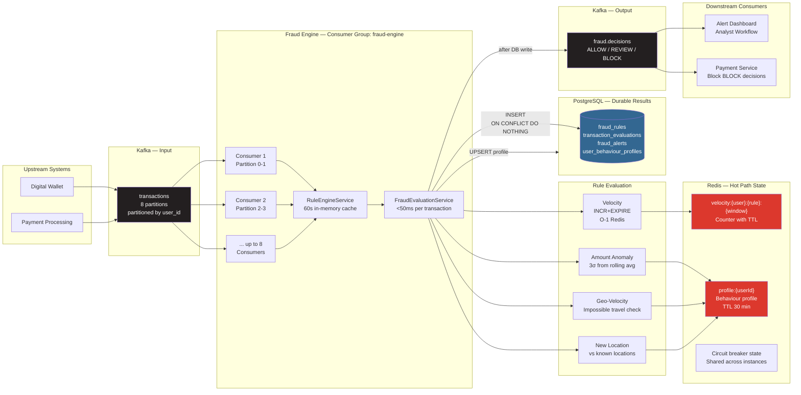

# Real-Time Fraud Detection System

A stream-processing fraud detection engine built with .NET 8, Kafka, Redis, and PostgreSQL. Evaluates every financial transaction against a configurable rule set in under 50ms, with velocity counters, geo-velocity checks, and amount anomaly detection.

---

## Quick Start

```bash
git clone <repo>
cd fraud-detection-system
cp .env.example .env
docker compose up --build
```

- **API:** http://localhost:8083
- **Swagger UI:** http://localhost:8083/swagger
- **Health:** http://localhost:8083/health

---

## Architecture



---

## Why I Built This

Fraud detection is the canonical stream processing use case. Every financial transaction must be evaluated against real-time signals (velocity, amount, location) before being acted upon, with sub-100ms latency. The challenge is that the signals require both fast in-memory operations (Redis velocity counters) and persistent state (user behaviour profiles in PostgreSQL), coordinated without blocking the payment pipeline. This system demonstrates how to build an evaluation engine that processes 10,000 transactions/second per consumer instance, with zero payment-path blocking.

---

## Key Design Decisions

**1. Kafka partitioned by user_id.** All transactions for a given user arrive at the same consumer instance in order. This is critical for velocity calculation (counting transactions in a time window per user) and geo-velocity (comparing consecutive locations). Without partitioning by user_id, two consecutive transactions from the same user could be evaluated by different instances simultaneously, making velocity and geo-velocity checks impossible without distributed locking.

**2. INCR + EXPIRE for velocity counters, not sorted sets.** A sorted set with ZRANGEBYSCORE gives exact sliding windows but costs O(log N) per operation and requires periodic pruning. `INCR + EXPIRE` is O(1) and approximates the window — accurate enough for fraud detection and dramatically simpler. The approximation only affects window boundaries (±1 window period), which is an accepted tradeoff.

**3. Idempotent evaluation via UNIQUE constraint.** The `transaction_evaluations.transaction_id` column has a UNIQUE constraint and the INSERT uses `ON CONFLICT DO NOTHING`. If the Kafka consumer crashes between evaluation and offset commit, the message is re-consumed and re-evaluated — but the second INSERT is silently ignored. This makes the consumer effectively exactly-once without distributed transactions.

**4. Rules loaded in memory, refreshed every 60 seconds.** Rule evaluation involves multiple conditional checks per rule. Querying the database for rules on every evaluation would add 5–15ms to every transaction — unacceptable given the 50ms total budget. An in-memory cache refreshed every 60 seconds means new rules activate within one minute of creation, without any deployment.

**5. Fail open on Redis unavailability.** If Redis is down, velocity counters return 0 and profile cache misses fall through to PostgreSQL. Amount anomaly and geo-velocity rules still fire (they read from the DB profile). The engine continues operating in degraded mode — some fraud goes undetected, but no transactions are incorrectly blocked due to a cache failure.

---

## What I Would Improve

- **ML-based risk scoring:** the current rules are deterministic threshold checks. A gradient-boosted classifier trained on historical fraud labels would catch complex patterns that simple rules miss.
- **Graph-based fraud rings:** the current model evaluates transactions in isolation. A graph database (Neo4j) tracking relationships between accounts, devices, and IP addresses would detect coordinated fraud networks.
- **Feature store:** velocity counters, behaviour profiles, and device fingerprints are currently computed on-demand. A proper feature store (Feast, Tecton) would pre-compute features and serve them at sub-millisecond latency.

---

---

## Running the System

```bash
docker compose up --build
```

### Demo Operations

**1. Create a fraud detection rule**

```bash
curl -s -X POST http://localhost:8083/api/v1/rules \
  -H "Content-Type: application/json" \
  -d '{
    "name": "High Velocity",
    "type": "velocity",
    "score": 40,
    "priority": 1,
    "parameters": {"threshold": 3, "window_seconds": 60}
  }' | jq .
```

**2. Evaluate a transaction**

```bash
curl -s -X POST http://localhost:8083/api/v1/transactions/evaluate \
  -H "Content-Type: application/json" \
  -d '{
    "transaction_id": "txn_demo_001",
    "user_id": "usr_alice",
    "amount": 500.00,
    "currency": "ZAR",
    "location_lat": -26.2041,
    "location_lng": 28.0473,
    "timestamp": "2024-01-15T10:30:00Z"
  }' | jq .
```

**3. Trigger velocity rule** — send 5 evaluations rapidly for the same user:

```bash
for i in {1..5}; do
  curl -s -X POST http://localhost:8083/api/v1/transactions/evaluate \
    -H "Content-Type: application/json" \
    -d "{\"transaction_id\":\"txn_vel_00$i\",\"user_id\":\"usr_bob\",\"amount\":100,\"currency\":\"ZAR\",\"timestamp\":\"2024-01-15T10:3${i}:00Z\"}" | jq .risk_score
done
# Watch the risk score climb as the velocity counter exceeds the threshold
```

**4. View open alerts**

```bash
curl -s "http://localhost:8083/api/v1/alerts?status=open" | jq .
```

**5. Resolve an alert**

```bash
curl -s -X POST http://localhost:8083/api/v1/alerts/alrt_xxx/resolve \
  -d '{"action": "false_positive", "notes": "Known merchant batch processing"}' | jq .
```
