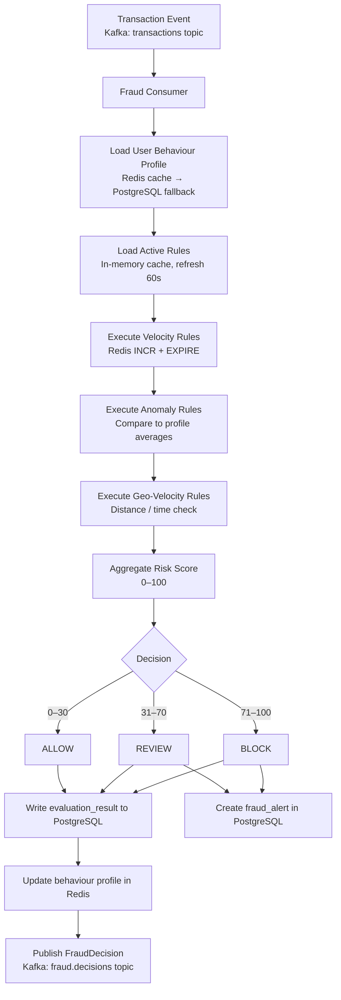
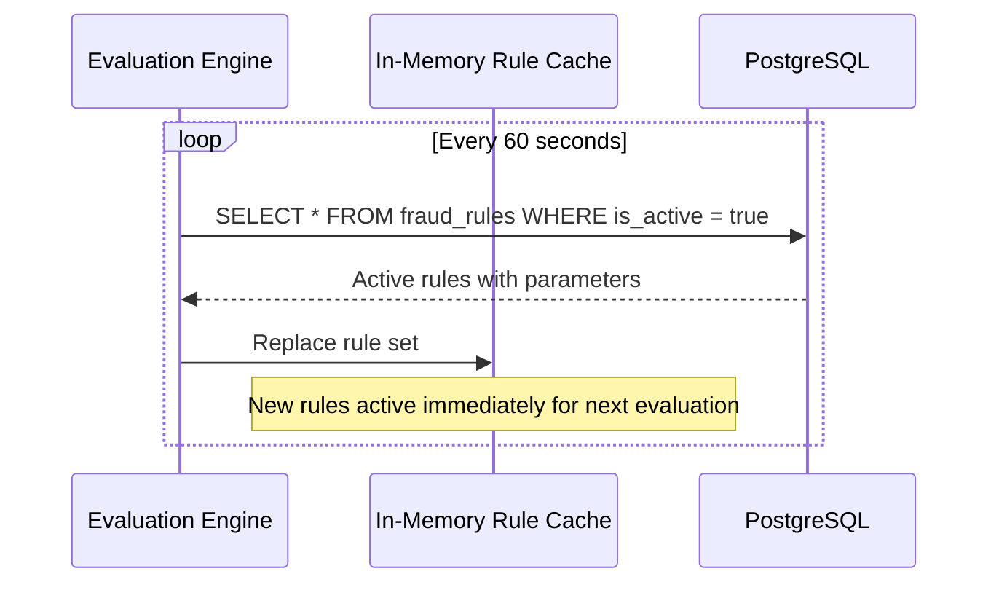
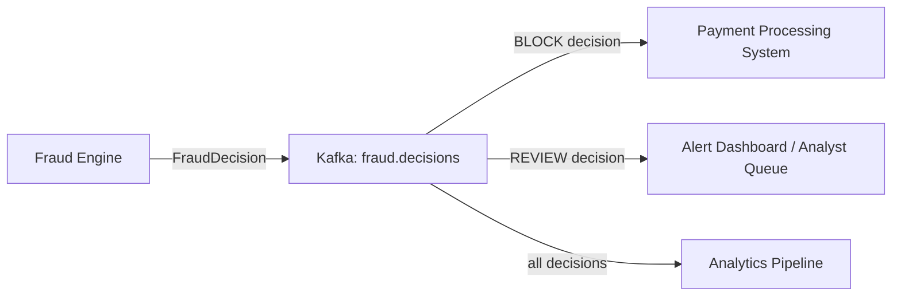

# Requirements — Real-Time Fraud Detection System

---

## Functional Requirements

**FR-01** — The system shall consume 100% of transaction events from the `transactions`
Kafka topic and evaluate each one for fraud risk.

**FR-02** — The system shall maintain a configurable set of fraud detection rules stored
in the database, each with a name, type, parameters, priority, and active flag.

**FR-03** — The system shall evaluate each transaction against all active rules in priority
order and aggregate the results into a risk score between 0 and 100.

**FR-04** — The system shall produce a fraud decision for each evaluated transaction:
ALLOW (score 0–30), REVIEW (score 31–70), or BLOCK (score 71–100).

**FR-05** — The system shall implement a velocity rule type: flag transactions where a
user has exceeded N transactions within a configurable rolling time window.

**FR-06** — The system shall implement an amount anomaly rule type: flag transactions
where the amount exceeds a configurable multiple of the user's average transaction amount.

**FR-07** — The system shall implement a geo-velocity rule type: flag transactions where
the physical distance and elapsed time since the previous transaction imply an impossible
travel speed.

**FR-08** — The system shall persist every evaluation result with the complete list of
rules that fired, the score each contributed, and the final decision.

**FR-09** — The system shall create a fraud alert record for every transaction with a
REVIEW or BLOCK decision, available for analyst retrieval via the Fraud API.

**FR-10** — The system shall publish a `FraudDecision` event to the `fraud.decisions`
Kafka topic after every evaluation, containing the transaction ID and the decision.

**FR-11** — The system shall allow an analyst to activate or deactivate a fraud rule via
the API, with the change taking effect within 60 seconds without a service restart.

**FR-12** — The system shall allow an analyst to resolve a fraud alert, recording the
resolution action and the resolving user.

---

## Non-Functional Requirements

### Availability

- **NFR-01** — The fraud evaluation pipeline shall maintain 99.9% uptime.
- **NFR-02** — A single consumer instance failure shall result in automatic Kafka partition
  rebalancing and no message loss (messages are re-consumed from the last committed offset).

### Latency

- **NFR-03** — End-to-end evaluation latency (Kafka message consumed to `FraudDecision`
  event published) p99 ≤ 50ms under steady-state load.
- **NFR-04** — Rule changes activated in the database shall take effect on the evaluation
  engine within 60 seconds.

### Throughput

- **NFR-05** — The system shall evaluate 100% of transactions at peak upstream throughput
  (200 TPS from Payment Processing) with zero message loss.
- **NFR-06** — Consumer group lag on the `transactions` topic shall not exceed 1,000
  messages under normal operating conditions.

### Durability

- **NFR-07** — Every evaluation result and decision shall be persisted to PostgreSQL before
  the Kafka offset is committed — ensuring at-least-once evaluation with idempotent writes.

### Consistency

- **NFR-08** — Velocity counters may exhibit a brief inconsistency window (≤ TTL of the
  counter) after a Redis restart. This is accepted as a graceful degradation mode.
- **NFR-09** — All evaluation results for a given transaction ID are idempotent — a duplicate
  evaluation overwrites rather than duplicates the result record.

---

## Estimated Traffic.

| Metric                             | Estimate                        |
| ---------------------------------- | ------------------------------- |
| Upstream transaction rate (steady) | 200 TPS                         |
| Upstream transaction rate (peak)   | 500 TPS                         |
| Evaluations per day                | ~17,280,000 (200 TPS × 86,400s) |
| Active fraud rules                 | 10–50                           |
| Redis velocity writes per second   | ~1,000 (5 rules × 200 TPS)      |
| Evaluation records stored/day      | ~17M rows (partitioned monthly) |
| FraudDecision events/day           | ~17M                            |
| Fraud alerts created/day (est. 1%) | ~172,000                        |

---

## Data Flow

### Transaction Evaluation Pipeline

### Rule Refresh Flow

### Fraud Decision Event Flow

